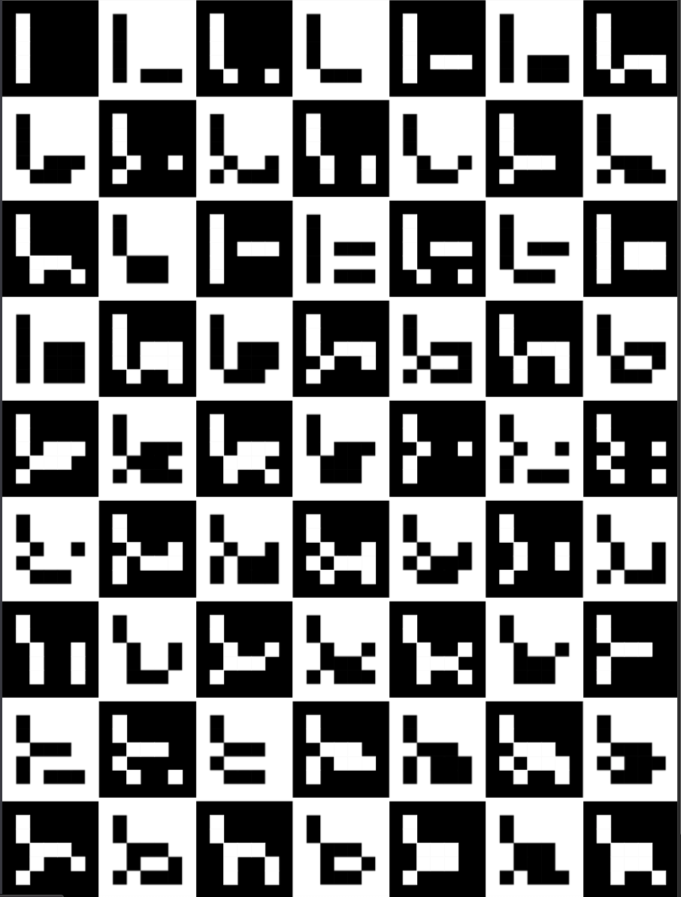

# aruco_checkerboard

## arcuco checkerboard generation

Generate an A4 ready to print, usefuel for photogrammetry or 3D scanning work.

You can supply the starting number for the board with a URl parameter start.

Originally inspired by: [**Plane Calibration Assignment**](http://mesh.brown.edu/3DP-2018/hw3/hw3.html).

Example output [PDF here](./assets/preview.pdf).

